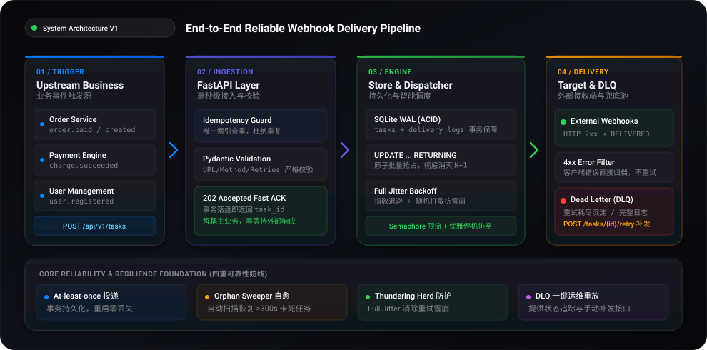
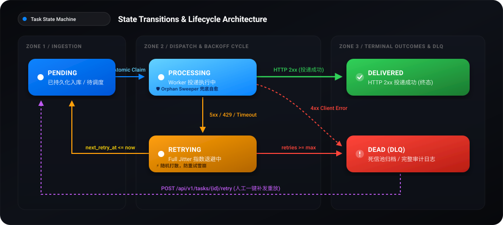
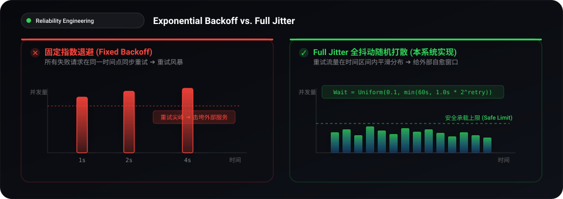

# API 通知系统设计与实现 (Outbound Webhook Delivery Engine)

> 本项目为企业级外部 API 异步可靠通知系统 MVP 实现，针对广告回传、CRM 更新、第三方库存同步等异构外部 Webhook 投递场景，提供高吞吐隔离、At-least-once 可靠投递、幂等防重、智能指数退避、状态孤儿自愈与死信恢复机制。

---

## 目录
- [一、 问题理解与系统定位](#一-问题理解与系统定位)
- [二、 系统边界界定 (System Boundaries)](#二-系统边界界定-system-boundaries)
- [三、 整体架构与核心设计](#三-整体架构与核心设计)
- [四、 可靠性保障与失败处理策略](#四-可靠性保障与失败处理策略)
- [五、 中间件选型与工程取舍说明](#五-中间件选型与工程取舍说明)
- [六、 系统演进路线 (V1 $\rightarrow$ V2 $\rightarrow$ V3)](#六-系统演进路线-v1--v2--v3)
- [七、 快速上手与运行验证](#七-快速上手与运行验证)
- [八、 API 接口规范](#八-api-接口规范)

---

## 一、 问题理解与系统定位

在现代企业架构中，核心业务（订单、支付、用户流转）经常需要与外部供应商进行联动。由于外部供应商的 API 具备**网络不可控、延迟 SLA 差异大、接口规范异构**等特征，若在业务事务内同步发起外部 HTTP 请求，极易导致主业务线程被阻塞、数据库连接耗尽，甚至因单点外部故障引发全局雪崩。

同时，业务系统本身**无需关心外部 API 的具体响应体**，核心诉求仅在于**“通知请求能被稳定、可靠、不遗漏地送达”**。

**系统的核心定位**：
> **「为上游业务系统提供吞吐隔离与可靠性托底，保证通知任务在进程重启、网络抖动或第三方暂时不可用的情况下，最终以 At-least-once（至少一次）语义送达。」**

---

## 二、 系统边界界定 (System Boundaries)

为了避免系统臃肿并保持高内聚，本项目对“做”与“不做”进行了明确界定：

### 1. 本系统解决的问题 (In-Scope)
- **请求持久化与防丢**：任务接收后立即落盘并快速响应 `202 Accepted`，保证服务重启或崩溃时任务不丢失。
- **业务幂等性防重**：上游业务系统可携带 `idempotency_key`，服务端通过唯一约束保证同一业务事件不会被重复创建。
- **并发隔离与超时熔断**：为外部请求配置严格的 Connect/Read 超时与并发信号量（`asyncio.Semaphore`），防止慢端点消耗耗尽资源。
- **智能退避与抗雪崩**：可恢复异常触发 Exponential Backoff + Full Jitter，打散重试流量，消除重试风暴（Thundering Herd）。
- **进程崩溃自愈 (Orphan Sweeper)**：通过扫描长时间停留在 `PROCESSING` 状态的任务并自动恢复，杜绝因节点宕机导致的“状态孤儿”漏单。
- **原子批量抢占 (Atomic Claiming)**：采用 `UPDATE ... RETURNING` 一步到位抢占任务，彻底消除 N+1 查询与多实例竞态条件。
- **优雅停机 (Graceful Shutdown)**：关机信号触发时安全等待在途请求排空，避免请求被粗暴截断。
- **死信管理 (DLQ) 与人工补发**：重试耗尽或 4xx 错误自动沉淀至死信池，支持运维查询与一键重放。
- **全链路审计**：记录每次尝试的时间戳、耗时、状态码与错误摘要。

### 2. 明确选择不解决的问题及原因 (Out-of-Scope)
- **❌ 不解决外部接收端的幂等性**
  - **原因**：本系统提供 At-least-once 语义。当发生网络 Read Timeout 时，外部可能已接收但响应在回传途中丢失，重试必然会导致外部接收多次。外部系统自身必须依据 Payload 中的唯一业务 ID（如 `order_id`）实现幂等，这是分布式 Webhook 的通用工业标准。
- **❌ 不解析外部系统的业务响应内容**
  - **原因**：系统作为通用投递管道，遵循传输层协议标准（HTTP 2xx 即视为成功）。不耦合任何外部供应商私有的 JSON Schema，保持系统通用性与无状态性。
- **❌ 不做异构数据格式转换与流程编排**
  - **原因**：Payload 的拼装属于上游业务领域逻辑，通知系统只负责原样可靠传输（Transparent Delivery），避免跨领域职责蔓延。

---

## 三、 整体架构与核心设计

### 1. 架构图

<p align="center">
  
</p>

### 2. 核心状态机设计

<p align="center">
  
</p>

---

## 四、 可靠性保障与失败处理策略

### 1. 投递语义：At-least-once（至少一次）
在分布式通信中，由于网络不可控（网络分区、丢包、客户端超时），绝对的“恰好一次 (Exactly-once)”在没有端到端两阶段协议支持下在理论上不可行。因此系统选择工业界标准的 **At-least-once** 语义，优先保障“绝不丢单”，允许极端网络抖动下的重复投递。

### 2. 状态孤儿自愈机制 (Orphan Task Recovery)
在长周期运行的异步系统中，若工作节点因 OOM、宿主机重启或断电意外崩溃，正在投递中的任务将永久停留在 `PROCESSING` 状态，导致任务丢失。
- 系统内置 **Orphan Sweeper**：启动时及后台周期性扫描 `status == 'PROCESSING' 且 updated_at <= now - 300s` 的任务。
- 自动将其状态回滚至 `RETRYING` 并记录审计日志，真正做到了进程意外重启后的零丢单自愈。

### 3. 指数退避与全抖动算法 (Exponential Backoff with Full Jitter)
当外部系统过载或网络抖动时，固定时间重试容易引发**重试风暴 (Thundering Herd)**，导致已过载的外部系统直接崩溃。
系统采用 Full Jitter 算法：
$$\text{CappedInterval} = \min(\text{MaxInterval}, \text{InitialBackoff} \times \text{Multiplier}^{\text{retry\_count}})$$
$$\text{WaitTime} = \text{random.uniform}(0.1, \text{CappedInterval})$$

<p align="center">
  
</p>

- 默认参数：`InitialBackoff = 1.0s`, `Multiplier = 2.0`, `MaxInterval = 60.0s`, `MaxRetries = 5`。
- 随机抖动将并发重试请求在时间轴上均匀打散，给外部系统留出自愈窗口。

### 4. 故障分类与决策矩阵
| 响应 / 异常类型 | 判定分类 | 处理策略 |
| :--- | :--- | :--- |
| `200 ~ 299` | 成功 | 标记 `DELIVERED`，记录耗时与状态码，结束生命周期 |
| `400, 401, 403, 404, 422` | 客户端错误 | 标记 `DEAD`（不可重试：参数/凭证错误重试无意义，避免浪费资源） |
| `429` | 速率限制 | 标记 `RETRYING`，计算退避时间并延后执行 |
| `500, 502, 503, 504` | 服务端瞬时故障 | 标记 `RETRYING`，执行退避重试 |
| `ConnectTimeout / ReadTimeout` | 超时异常 | 标记 `RETRYING`，执行退避重试 |
| `retry_count >= max_retries` | 重试耗尽 | 标记 `DEAD`（进入死信池，触发告警） |

### 5. 死信处理与人工恢复 (DLQ Replay)
对于进入 `DEAD` 状态的任务，系统保留完整的失败审计记录，并提供运维 API：
- `GET /api/v1/tasks?status=DEAD`：检索所有死信任务及错误原因。
- `POST /api/v1/tasks/{task_id}/retry`：在外部供应商恢复或配置修复后，一键重置重试计数并重新投递。

---

## 五、 中间件选型与工程取舍说明

### 1. 本 MVP 选择的方案：FastAPI + SQLite (WAL模式) + 异步自包含调度
- **选择理由**：
  1. **零外部中间件依赖**：单机自包含，环境搭建极简，`uv run pytest` 开箱即测。
  2. **ACID 强一致性**：SQLite WAL（Write-Ahead Logging）模式支持并发读写与事务持久化，从根本上杜绝了纯内存队列在进程崩溃时的丢数据风险。
  3. **架构与业务匹配**：MVP 阶段重点验证核心可靠性闭环，避免过早引入重型分布式组件。

### 2. 替代方案对比分析
| 方案 | 优势 | 劣势 | 为什么 MVP 未采用 |
| :--- | :--- | :--- | :--- |
| **Redis + Celery** | 任务队列生态成熟，吞吐量高 | Redis 默认基于内存（AOF/RDB 极端情况可能丢数），引入外部 Redis 服务依赖与运维成本 | 增加系统部署依赖，且 Celery 较重，对超时精细控制和差异化状态码退避定制较繁琐 |
| **PostgreSQL + Transactional Outbox** | 生产级关系型存储，高并发行锁 | 需要独立 PG 实例，单机测试稍显繁琐 | 代码已基于 SQLAlchemy 异步封装，无缝平滑迁移至 PostgreSQL |
| **Kafka / RabbitMQ** | 超大规模高吞吐削峰 | 引入复杂集群运维与消费端幂等管理 | 严重超出了 MVP 阶段的复杂度要求 |

---

## 六、 系统演进路线 (V1 $\rightarrow$ V2 $\rightarrow$ V3)

如果本系统在未来面临百万级日吞吐或更高复杂度的增长，建议按以下三阶段演进：

```text
【V1: MVP 阶段】(当前实现)
FastAPI + SQLite WAL / 单体异步协程调度 / Orphan Sweeper / Atomic Claiming
  │
  ▼
【V2: 吞吐提升与高可用】
FastAPI 集群 + PostgreSQL + Redis Stream (或 RabbitMQ)
• 引入 Transactional Outbox Pattern 保证消息零丢失
• 多实例水平扩展，由独立 Worker 集群消费分发
  │
  ▼
【V3: 多租户与供应商隔离】
按目标域名隔离独立队列 (Per-Host Queueing & Dynamic Rate Limiting)
• 单一慢供应商或故障端点仅堵塞自身队列，绝不影响其他正常供应商
• 自适应限流 (Token Bucket / Leaky Bucket) 动态适配第三方 SLA
```

---

## 七、 快速上手与运行验证

### 1. 环境准备
本项目使用 `uv` 进行现代化的 Python 环境与依赖管理（支持 Python 3.11+ / 3.12 / 3.14）：

```bash
# 1. 安装项目依赖
uv sync
```

### 2. 运行单元与集成测试
测试套件覆盖了 200 成功、503 退避重试、401 立即死信、网络超时、幂等去重、死信重放、孤儿任务自愈、并发信号量限制等 20 个关键测试场景：

```bash
uv run pytest -v
```

### 3. 代码质量与规范检查 (Ruff 0 警告)
```bash
uv run ruff check .
```

### 4. 一键运行自动化端到端演示 (Live Demo)
项目内置了 `mock_server.py`（模拟各类正常/抖动/超时的外部接口）与 `demo_verify.py`：

```bash
# 启动外部模拟桩 (终端 1)
uv run uvicorn mock_server:app --host 127.0.0.1 --port 9000

# 启动通知主服务 (终端 2)
uv run python main.py

# 执行端到端完整演示脚本 (终端 3)
uv run python demo_verify.py
```

---

## 八、 API 接口规范

### 1. 提交通知任务
- **Endpoint**: `POST /api/v1/tasks`
- **Status**: `202 Accepted`
- **Request Body**:
```json
{
  "target_url": "https://api.partner.com/webhook",
  "method": "POST",
  "headers": {
    "Authorization": "Bearer token123",
    "Content-Type": "application/json"
  },
  "body": "{\"event\": \"order_paid\", \"order_id\": \"ord_9901\"}",
  "idempotency_key": "pay_evt_ord_9901",
  "max_retries": 5
}
```
- **Response**:
```json
{
  "id": "7b8782f9-1e3a-4467-b501-c9eb1369cf89",
  "idempotency_key": "pay_evt_ord_9901",
  "target_url": "https://api.partner.com/webhook",
  "method": "POST",
  "status": "PENDING",
  "retry_count": 0,
  "max_retries": 5,
  "next_retry_at": "2026-08-28T03:30:00.000Z",
  "created_at": "2026-08-28T03:30:00.000Z",
  "updated_at": "2026-08-28T03:30:00.000Z"
}
```

### 2. 查询任务详情与审计历史
- **Endpoint**: `GET /api/v1/tasks/{task_id}`
- **Response**: 返回包含 `status`、`last_error` 以及完整的 `logs: [...]` 投递尝试记录（状态码、耗时、报错等）。

### 3. 任务列表与状态筛选
- **Endpoint**: `GET /api/v1/tasks?status=DEAD&page=1&page_size=20`

### 4. 死信重放
- **Endpoint**: `POST /api/v1/tasks/{task_id}/retry`
- **Response**: `{"task_id": "...", "status": "PENDING", "message": "Task successfully re-queued for immediate delivery"}`
